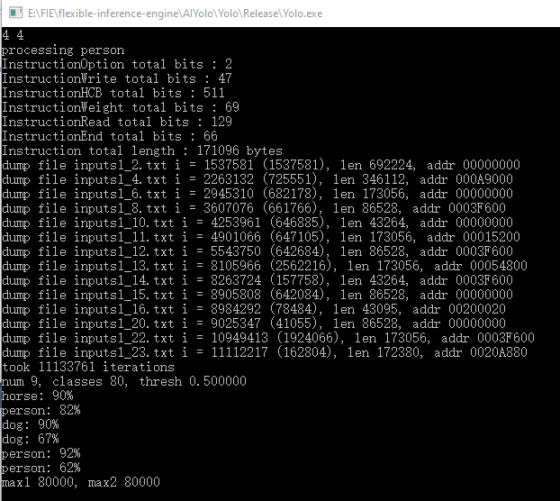
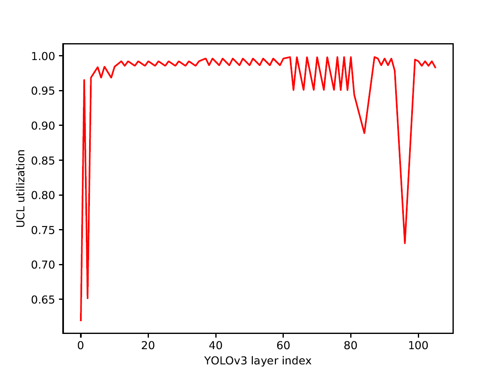
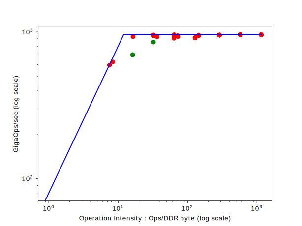
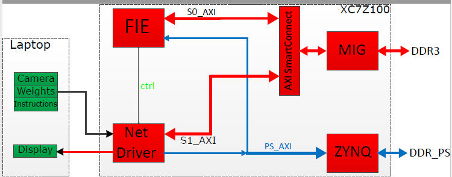
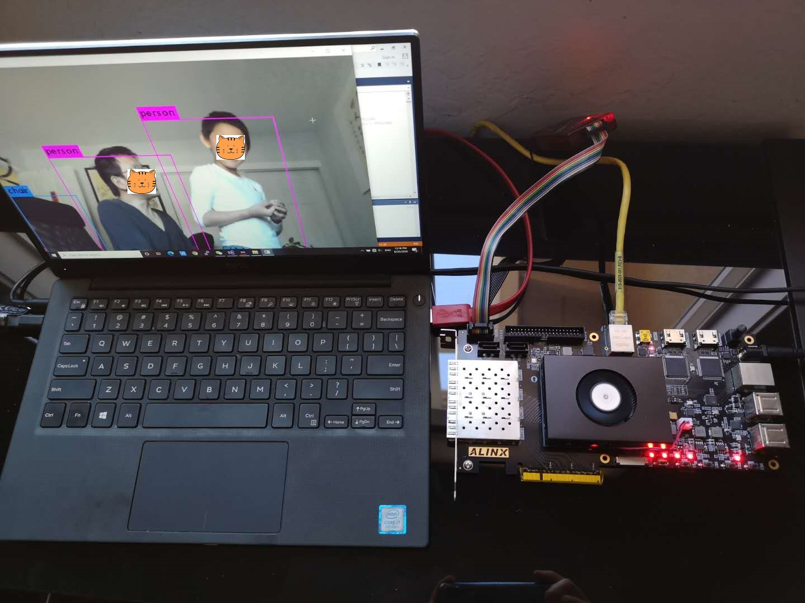
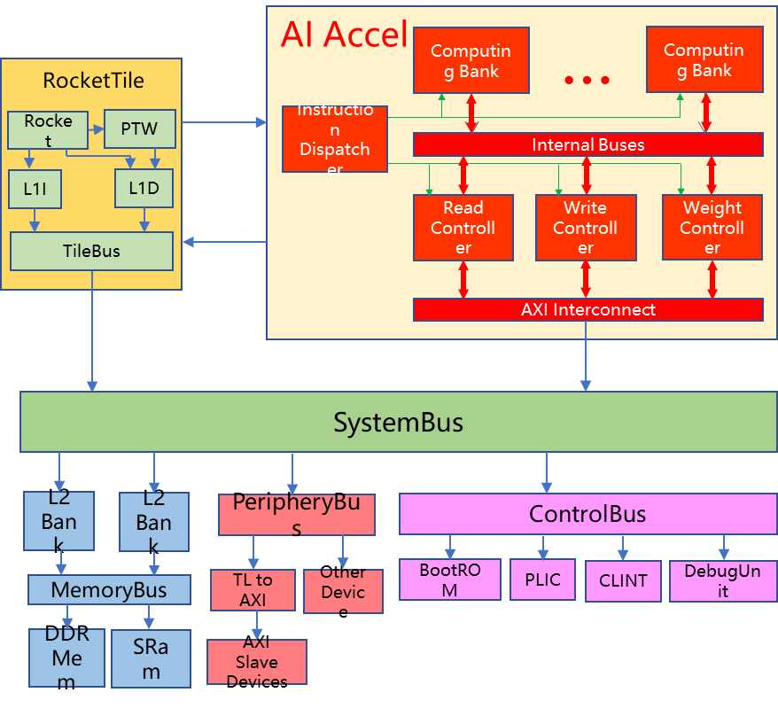

# Flexible Inference Engine - an effective deep learning accelerator for inference

This project is about implementing a deep learning accelerator. I will describe each sub-project in chronological order.

## AISimTiny
This C++ project is a cycle by cycle accurate simulator of the inference engine. It enables a fast turnaround of exploring the architecture and experimenting with different parameters.  [This paper](data/FIE.pdf) provides a detailed description of the core architecture. The compiling environment for this project is Microsoft Visual Studio 2013. 
  
## AIYolo
I used [YOLOv3](https://github.com/pjreddie/darknet) as an example to demonstate the system. This project uses the quantized data, runs through the inference system, and generates the final results as shown in the following picture (YOLOv3-tiny example).

The following two pictures shows the layer utiliztion and roofline data of executing an YOLOv3-320 model. It turns out
that utilizations of convolution layers with 𝐾 = 3 are higher than
99%, and utilizations of convolution layers with 𝐾 = 1 are around
95%. This is because convolutions with 𝐾 = 1 require more data
bandwidth. There are 4 outliers in the utilization picture, layer 0 with utilization 62%, layer
2 with utilization 65%, layer 84 with utilization 89%, and layer 96
with utilization 73%. Layer 0 and 2 are actually bounded by data
bandwidth, not by computation. Layer 84 and Layer 96 are up sample layers, and they are shown as green dots on the roofline picture.
 

## AIFPGA
The systemverilog implementation of the inference engine. The system is verified with modelsim simulator, the testbenchs can be found in the directory *AIFPGA/sv/sv.srcs/sources_1/sim* . The data used for the simulation are generated by the AISimTiny project. After all the modules are verified with the modelsim simulator, we implemented the FIE accelerator on an AX7Z100 development
board from Alinx. The AX7Z100 board uses an Xilinx Zynq-7000
SoC XC7Z100-2FFG900 FPGA device as its main processing unit. The modelwe used for this part is YOLOv3-tiny because XC7Z100
device does not have enough resources to run bigger YOLO models
in realtime.
The following picutre is the diagram of how we set up the YOLO object detection
system with our FIE accelerator. We use both a laptop and the
AX7Z100 development board for the system. We use the camera on
the laptop to capture images and send them to FPGA periodically.
When the system is initialized, the laptop sends the instruction
stream and weight data to FPGA (these data only need to be sent
once). A laptop is also used to receive computation results from
FPGA and displays detected images. On the AX7Z100 board, PL side
DDR3 SDRAM (DDR3) is used for storing instructions and data. PS
side DDR3 (DDR_PS) is used for weight data. DDR_PS is connected
to ZYNQ core, so we have to access DDR_PS using the ZYNQ
device as a proxy. Initially, FPGA receives weight data through
the ethernet interface and sends them to DDR_PS using the write
channel of PS_AXI. It also receives instruction streams and image
data, and sends them to DDR3 through the write channel of S1_AXI.
Whenever the net driver receives an image completely, it signals
the FIE accelerator by sending it the start address of instructions.
Then FIE start to fetch instructions and executes them. FIE reads
weight data through the read channel of PS_AXI from DDR_PS. FIE
reads and writes data using the S0_AXI bus. Whenever FIE finishes
its computations, it signals the net driver. Then the net driver reads
results using the read channel of S1_AXI bus from DDR3, and sends
them to the laptop through ethernet. 

The following picture shows a screen shot of the running system.

## YoloClient
This project is used for the FPGA implementation as a client of sending the image data, receiving the processed data, and displaying the detection results.

## DeepRV
The final project is to implement the inference engine as a coprocessor of a RISCV processor. 
1. The project was initially implemented within [chipyard1.1](https://github.com/ucb-bar/chipyard) (commit id f0ba107). The files from *deeprv/src* are put into the chipyard generators directory and the file *deeprv/patch* is used to patch the chipyard to build a system shown in the following picture. The files from *deeprv/tests* and *deeprv/src/test/csrc/intrpt.c* were used to verify the system. I used verilator to run the simulation.
2. Then I used [freedom](https://github.com/sifive/freedom) (commit id 943ab4a) to generate the bitstream that can be used on Xilinx VC707 board.
3. Finally, I used the system from the [keystone](https://github.com/keystone-enclave/keystone) project (commit id 500bc77) to build the embedded system that can boot and run on the riscv implemented on VC707. The file *deeprv/embedded OS/deeprv.c* is the kernel module for using the FIE accelerator, and the file *deeprv/embedded OS/example.c* is used to test the system. [The video](data/Record_booting.mp4) shows the booting part of the system, and [the video](data/Record_exec.mp4) shows how the kernel module is installed, and the test example program is executed. The test program generates the *deep.ot* file, and this file has been verified with the correct version.

